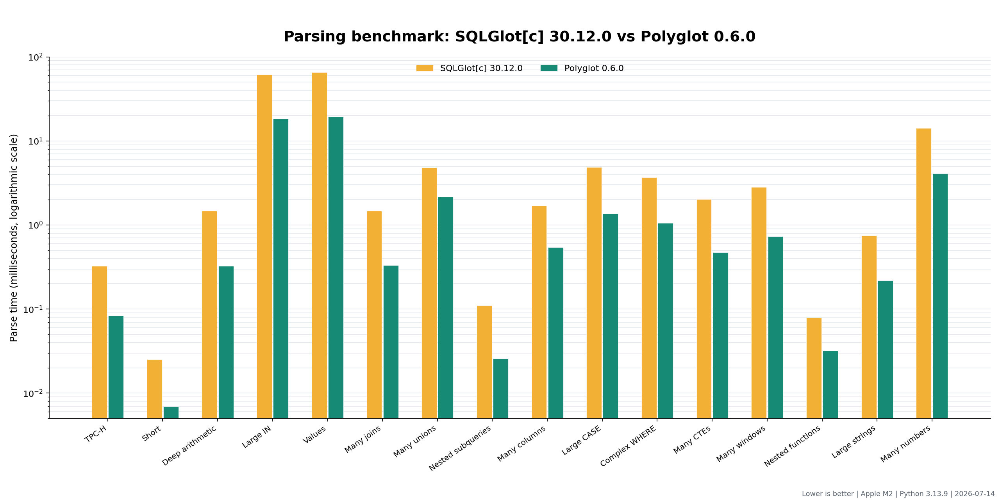
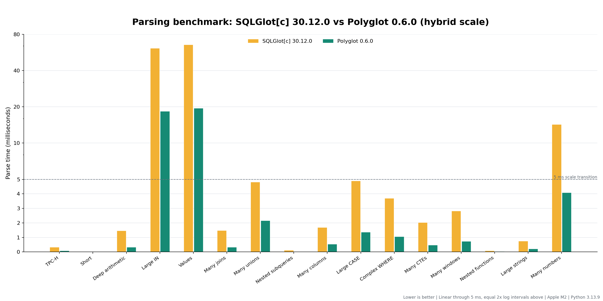
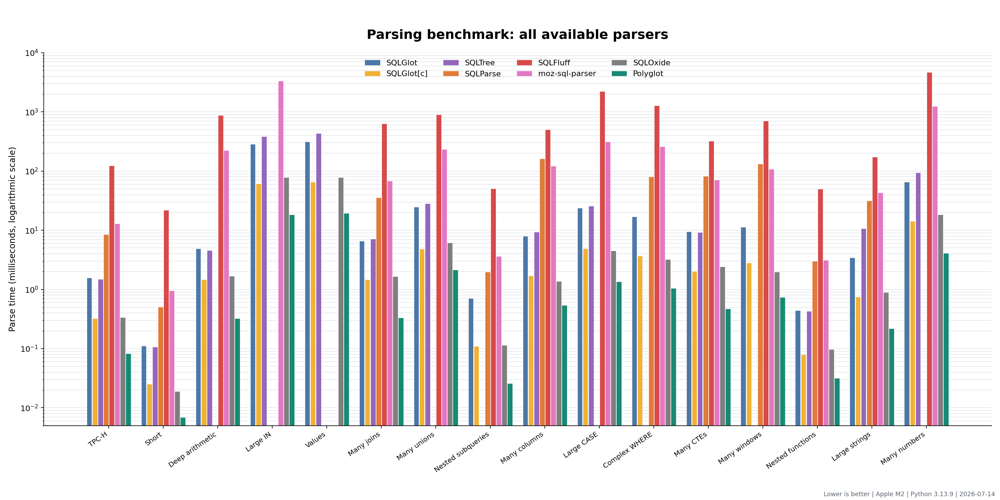
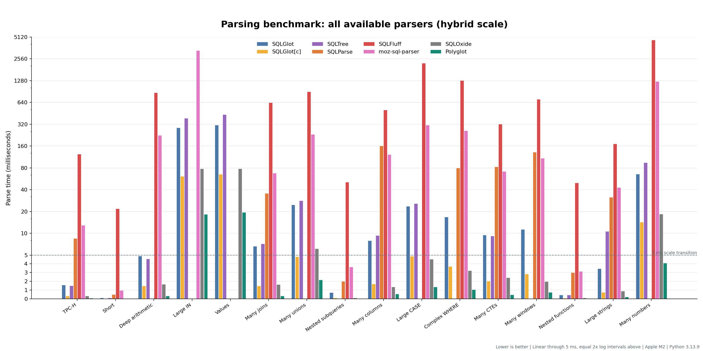

# Current Parsing Benchmarks

This report compares the published Polyglot 0.6.0 Python package with SQLGlot and
the other parsers registered by SQLGlot's upstream `benchmarks/parse.py` script.
The measurements were recorded on 2026-07-14.

## Benchmark Setup

### Machine

| Component | Value |
|---|---|
| Machine | Mac mini |
| Processor | Apple M2, 8 cores (4 performance and 4 efficiency) |
| Memory | 16 GB |
| Architecture | arm64 |
| Operating system | macOS 26.5.2 (build 25F84) |
| Python | CPython 3.13.9 |

### Parser Versions

| Package | Version |
|---|---:|
| Polyglot | 0.6.0 |
| SQLGlot | 30.12.0 |
| SQLGlot compiled extensions (`sqlglot[c]`) | 30.12.0 |
| SQLTree | 0.3.0 |
| SQLParse | 0.5.5 |
| SQLFluff | 4.0.4 |
| moz-sql-parser | 4.40.21126 |
| SQLOxide | 0.1.56 |

Polyglot was installed from the published `polyglot-sql==0.6.0` wheel. SQLGlot
and its `sqlglot[c]` mypyc-compiled native extensions were installed from the
published 30.12.0 packages. The benchmark script came from the locally checked
out SQLGlot v30.12.0 source at commit `64e268a5d95cd84a87ad74ef569fc9bf356fd3fb`.

`moz-sql-parser` 4.40 still imports `Iterable` from `collections`, which Python
3.13 no longer provides. A benchmark-only `sitecustomize.py` alias mapped it to
`collections.abc.Iterable`; no parser source was modified.

### Method

The benchmark used SQLGlot's unmodified `benchmarks/parse.py` query corpus and
runner. It contains 16 generated parser stress cases covering short SQL, a
TPC-H-style query, large lists, joins, unions, CTEs, windows, nested expressions,
and wide projections.

For every parser and supported query, the script:

1. Runs a capability check in a separate subprocess with a five-second alarm and
   a ten-second subprocess timeout.
2. Measures the parse call with `time.perf_counter()`.
3. Reports the fastest elapsed time from up to five calls. If a call takes more
   than one second, the script stops repeating that parser/query pair.

SQLGlot is called through `parse_one(..., error_level=IGNORE)`, Polyglot through
`parse_one`, SQLOxide with its ANSI dialect, and the other parsers through the
functions defined in the upstream benchmark. The benchmark measures parsing and
Python API object creation only; it does not serialize or otherwise consume the
resulting AST.

When compiled SQLGlot modules are present, the script first measures SQLGlot[c],
temporarily hides the compiled modules to measure pure-Python SQLGlot, and then
restores them. For this run, the upstream Makefile was copied into the isolated
environment's site-packages directory so its `hidec` and `showc` targets could
toggle the installed extensions. The benchmark was then invoked from that
directory because the upstream script detects compiled modules relative to its
working directory:

```bash
ROOT="$(pwd)"
PYTHON="$ROOT/target/performance/sqlglot-all-v0.6.0/.venv/bin/python"
SITE_PACKAGES="$("$PYTHON" -c \
  'import sysconfig; print(sysconfig.get_paths()["purelib"])')"

cp "$ROOT/external-projects/sqlglot/Makefile" "$SITE_PACKAGES/Makefile"
cd "$SITE_PACKAGES"
PYTHONPATH="$ROOT/target/performance/sqlglot-all-v0.6.0/compat" \
  "$PYTHON" "$ROOT/external-projects/sqlglot/benchmarks/parse.py" \
    --quiet \
    --json "$ROOT/target/performance/sqlglot-parse-all-c-v0.6.0.json"
```

The run used an isolated Python environment containing all packages listed
above. Times are single-machine measurements rather than confidence intervals.

## SQLGlot 30.12.0 and Polyglot 0.6.0

| Query | SQLGlot | SQLGlot[c] | Polyglot | SQLGlot / Polyglot | SQLGlot[c] / Polyglot |
|---|---:|---:|---:|---:|---:|
| TPC-H | 1.570 ms | 325.8 us | **83.2 us** | 18.87x | 3.92x |
| Short | 111.7 us | 25.2 us | **6.9 us** | 16.15x | 3.64x |
| Deep arithmetic | 4.897 ms | 1.468 ms | **325.7 us** | 15.03x | 4.51x |
| Large `IN` | 286.469 ms | 61.209 ms | **18.340 ms** | 15.62x | 3.34x |
| Values | 313.012 ms | 65.480 ms | **19.440 ms** | 16.10x | 3.37x |
| Many joins | 6.621 ms | 1.471 ms | **330.8 us** | 20.01x | 4.45x |
| Many unions | 24.742 ms | 4.820 ms | **2.159 ms** | 11.46x | 2.23x |
| Nested subqueries | 707.0 us | 110.0 us | **25.8 us** | 27.37x | 4.26x |
| Many columns | 7.915 ms | 1.696 ms | **540.8 us** | 14.64x | 3.14x |
| Large `CASE` | 23.688 ms | 4.891 ms | **1.362 ms** | 17.39x | 3.59x |
| Complex `WHERE` | 16.883 ms | 3.696 ms | **1.055 ms** | 16.00x | 3.50x |
| Many CTEs | 9.480 ms | 2.033 ms | **471.8 us** | 20.09x | 4.31x |
| Many windows | 11.370 ms | 2.828 ms | **737.0 us** | 15.43x | 3.84x |
| Nested functions | 444.3 us | 79.4 us | **31.8 us** | 13.96x | 2.49x |
| Large strings | 3.460 ms | 747.6 us | **220.0 us** | 15.73x | 3.40x |
| Many numbers | 65.632 ms | 14.258 ms | **4.085 ms** | 16.06x | 3.49x |

Across these 16 queries, the geometric-mean ratio is **16.57x in Polyglot's
favor against pure-Python SQLGlot** and **3.53x in Polyglot's favor against
SQLGlot[c]**. Polyglot recorded the lowest parse time for every query in this
run.



The focused chart compares SQLGlot[c] 30.12.0 with Polyglot 0.6.0 on a
logarithmic millisecond axis because the queries span more than four orders of
magnitude. Lower bars indicate shorter parse times. Pure-Python SQLGlot remains
available in the table above and in the all-parser charts below.



The hybrid y-axis is linear from 0 through 5 ms and logarithmic above 5 ms; the
dashed line marks the transition. The logarithmic region uses base-2 ticks at
`5, 10, 20, 40, 80, ...`, so every equally spaced interval represents an exact
doubling. This focused chart compares only the two native-backed
implementations, SQLGlot[c] 30.12.0 and Polyglot 0.6.0. It preserves absolute
differences among the faster and medium-sized cases while compressing the
largest `large_in` and `values` measurements enough to keep them in the same
chart. The fully logarithmic focused chart above remains better for comparing
the smallest sub-millisecond results between the two native-backed
implementations.

## All Parsers

| Query | SQLGlot | SQLGlot[c] | SQLTree | SQLParse | SQLFluff | moz-sql-parser | SQLOxide | Polyglot |
|---|---:|---:|---:|---:|---:|---:|---:|---:|
| TPC-H | 1.570 ms | 325.8 us | 1.486 ms | 8.526 ms | 124.409 ms | 12.980 ms | 335.8 us | **83.2 us** |
| Short | 111.7 us | 25.2 us | 107.2 us | 504.1 us | 21.991 ms | 954.1 us | 19.0 us | **6.9 us** |
| Deep arithmetic | 4.897 ms | 1.468 ms | 4.573 ms | N/A | 873.134 ms | 225.093 ms | 1.677 ms | **325.7 us** |
| Large `IN` | 286.469 ms | 61.209 ms | 387.226 ms | N/A | N/A | 3.334 s | 78.305 ms | **18.340 ms** |
| Values | 313.012 ms | 65.480 ms | 436.246 ms | N/A | N/A | N/A | 77.763 ms | **19.440 ms** |
| Many joins | 6.621 ms | 1.471 ms | 7.182 ms | 35.646 ms | 637.490 ms | 67.938 ms | 1.651 ms | **330.8 us** |
| Many unions | 24.742 ms | 4.820 ms | 28.215 ms | N/A | 905.975 ms | 233.456 ms | 6.134 ms | **2.159 ms** |
| Nested subqueries | 707.0 us | 110.0 us | N/A | 1.990 ms | 50.803 ms | 3.649 ms | 115.2 us | **25.8 us** |
| Many columns | 7.915 ms | 1.696 ms | 9.329 ms | 162.033 ms | 506.592 ms | 122.460 ms | 1.369 ms | **540.8 us** |
| Large `CASE` | 23.688 ms | 4.891 ms | 25.872 ms | N/A | 2.229 s | 313.229 ms | 4.533 ms | **1.362 ms** |
| Complex `WHERE` | 16.883 ms | 3.696 ms | N/A | 80.125 ms | 1.286 s | 260.769 ms | 3.237 ms | **1.055 ms** |
| Many CTEs | 9.480 ms | 2.033 ms | 9.233 ms | 83.036 ms | 321.771 ms | 71.399 ms | 2.421 ms | **471.8 us** |
| Many windows | 11.370 ms | 2.828 ms | N/A | 132.096 ms | 711.906 ms | 108.786 ms | 1.981 ms | **737.0 us** |
| Nested functions | 444.3 us | 79.4 us | 431.9 us | 3.001 ms | 49.878 ms | 3.146 ms | 97.5 us | **31.8 us** |
| Large strings | 3.460 ms | 747.6 us | 10.659 ms | 31.556 ms | 172.561 ms | 42.992 ms | 895.7 us | **220.0 us** |
| Many numbers | 65.632 ms | 14.258 ms | 95.015 ms | N/A | 4.676 s | 1.248 s | 18.437 ms | **4.085 ms** |





The all-parser hybrid view uses the same linear 0-5 ms region and base-2
logarithmic region above the dashed transition. Its `5, 10, 20, 40, ...` ticks
therefore have consistent doubling intervals. It keeps the faster parsers
visible while still showing multi-second SQLFluff and moz-sql-parser results.
The fully logarithmic version above provides the clearest relative comparison
across the entire parser set.

Polyglot, SQLGlot, SQLGlot[c], and SQLOxide completed all 16 capability checks.
SQLTree completed 13, SQLParse 10, SQLFluff 14, and moz-sql-parser 15. Missing
bars and `N/A` cells mean that the parser errored or timed out during capability
discovery; they do not represent measured parse times.

## Interpretation

These tools do not all provide equivalent behavior. SQLParse is primarily a
non-validating parser/tokenizer, SQLFluff performs richer structural work, and
the parsers differ in accepted syntax, error recovery, dialect defaults, and AST
construction. The benchmark measures the specific public calls selected by
SQLGlot's script, not equivalent correctness or feature coverage.

The fastest-of-five method also favors best-case latency and does not show
variance, cold-start cost, memory usage, throughput under concurrency, or
end-to-end work such as AST serialization and SQL generation. The results should
therefore be read as a reproducible snapshot for this corpus and environment,
not as a universal performance claim.
